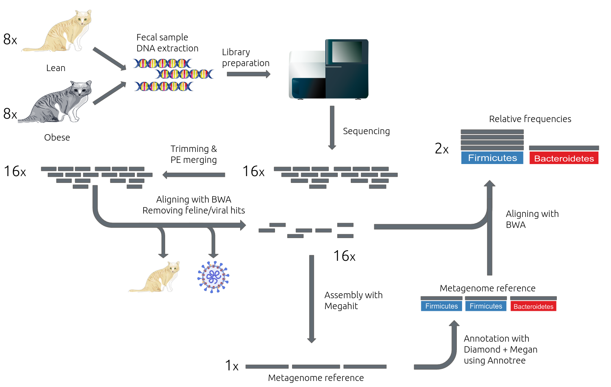

# Reproducibility of the paper "Whole-Genome Shotgun Metagenomic Sequencing Reveals Distinct Gut Microbiome Signatures of Obese Cats"
by [Jules Kreuer](https://juleskreuer.eu), [Dario Eltzner](https://github.com/Schmoho) and Philip Höllein for the Bioinformatics Seminar BIOINF4240 at the University of Tübingen.

This repository contains all supplementary files for the above-mentioned paper/report.

| Filename | Description |
| -------- | ----------  |
| contig_size_anaysis |  R script and raw data for the contig-size analysis |
| data | Data such as computed contigs and conda enviroment exports |
| pipeline | The complete pipeline including all scripts | 

## Abstract
Obesity is an issue that deserves investigation even in domestic cats. Here we try and reproduce the whole-genome shotgun metagenomic study performed by Ma et al. Using a subset of the available data produced by the study, we reconstruct a reference metagenome from both obese and lean cats and use this for whole-genome-based taxonomic community profiling. In this, we are able to reproduce the main features of the discovered community profile. Furthermore, we assess the degree to which the authors have made possible a faithful reproduction of their results and identify minor – but often overlooked – aspects of providing open data and detailing the methodology that is missing from the paper as published

## Pipeline overview
